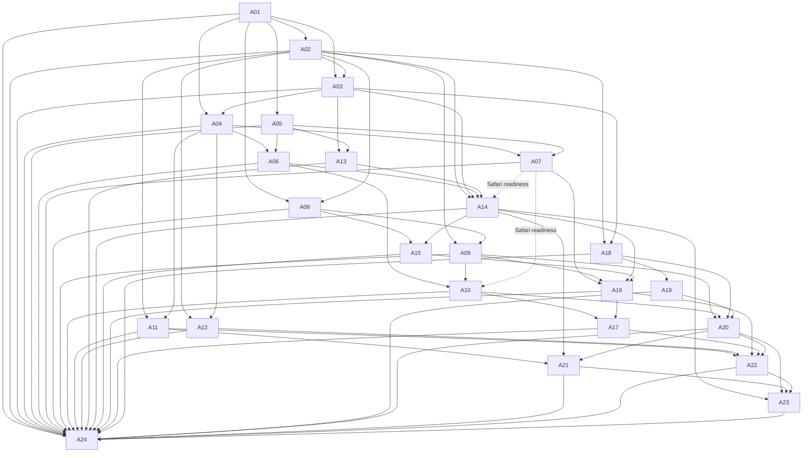

# Wisp Browser and Proactive Planning

## Scope and architecture

A01 establishes contracts only. The approved program runs from A01 through A24;
only the Wisp Hub dispatches program workers, with the Autonomous Orchestrator's
ownership acknowledgement. At most three eligible program workers may run at
once. Dependencies and exclusive path ownership determine eligibility. A01 does
not implement automation, persistence/migration, native integration, external
effects, installation, or deployment.

```
observations → local extraction/reconciliation → tracked obligations
             → Today work blocks/proposals → exact approval/execution
             → verified receipts → native/browser reconciliation
```

These are separate concepts:

- **SourceObservation**: a captured source revision, capture time, text and stable
  source identity. Capture time is distinct from an obligation deadline.
- **Evidence**: a quote tied to an observation and its revision. A quote is not
  independently verified merely because it passes schema validation.
- **ActionableItem**: the obligation, with evidence, uncertainty, deadline,
  revision and completion receipt. It is not a Calendar event or Reminder.
- **ScheduledBlock**: time allocated to work on an obligation. Completing a block
  does not imply submitting an assignment or completing the obligation.
- **ExternalRecord**: a separately versioned record in a native or browser system.
  IDs and evidence link it to local state without conflating their lifecycles.
- **ActionProposal**: a proposed exact action tied to an obligation revision and
  evidence. Proposal state alone is never approval authority.
- **BrowserSnapshot / BrowserAction / BrowserTask**: a document-scoped DOM/text
  view, exact action intent and durable investigation state respectively.
- **ActionReceipt**: the observed result. `uncertain` cannot complete an obligation
  and must be reconciled before an effect is retried. A verified scheduling or
  publishing receipt need not complete the underlying obligation.

## A01 wire contract, version 1.0

The canonical closed schema is `service/browser/contracts.py::SCHEMA`. Python
and JavaScript validators and Foundation-only Swift Codable records share the
same field registry. `scripts/check_browser_contracts.py` detects schema/type
mirror drift and runs the same synthetic corpus through all three runtimes.
`--sync-schema` explicitly regenerates the owned JS/Swift schema/type sections.
The checker never opens an application, contacts a site, or writes user state.

All object keys are required; nullable keys are encoded as JSON `null`. Unknown
keys, commands, enum values and schema versions are rejected. UTC timestamps
are nonnegative Unix milliseconds bounded by JavaScript's safe integer range;
numbers must be integral, and booleans are not integers. Text limits count Unicode
scalar values; unpaired surrogates are rejected. IDs are bounded ASCII opaque strings. URLs are limited to HTTP(S)
without user-info and with ASCII/percent-encoded paths; source content and URLs remain untrusted. This is a deliberately
restricted wire URL grammar, not a general URL parser or permission allowlist.

Every top-level record carries `schema_version: "1.0"`. The initial release
supports exactly 1.0; a future version requires a deliberate protocol update.
Handshake peers advertise supported versions, capabilities and required
capabilities. Both peers' requirements must be in the capability intersection.
`incompatible_version` and `missing_capability` are explicit errors. A successful
handshake does not authenticate a peer or grant site/approval permission.

Capabilities: `dom_text`, `exact_app_approval`, `verified_receipts`,
`local_discovery`. Commands: `snapshot`, `navigate`, `click`, `fill`, `select`,
`scroll`, `back`, `wait`, `open_tab`, `handoff`. There is no arbitrary-JavaScript
command. Document/snapshot-scoped target IDs are required for click/fill/select;
URLs apply only to navigation/open-tab, and text only to fill/select.

Browser task states: `queued`, `running`, `waiting_approval`, `waiting_user`,
`paused_foreground`, `handed_off`, `succeeded`, `failed`, `cancelled`,
`outcome_unknown`. These expose browser-specific pause/handoff states while A02's
durable job abstraction retains its specified states below. State transitions,
claims and restart recovery belong to A02/A14; A01 validates state values and
rejects runnable tasks whose budget is exhausted.

Errors: `incompatible_version`, `missing_capability`, `invalid_payload`,
`disabled`, `site_permission_denied`, `private_context`, `foreground_preempted`,
`budget_exhausted`, `no_progress`, `unsupported_control`, `approval_required`,
`stale_approval`, `stale_snapshot`, `uncertain_receipt`, `bridge_unauthorized`,
`cancelled`. `retryable` is descriptive, not authorization to repeat an effect.

## Safety and runtime obligations

The contracts express the future defaults; they do not implement or prove the
live controls. Consumers must validate untrusted payloads before typed decoding
or use. Swift consumers use `WispBrowserContracts.decode`, not bare JSONDecoder.

- Explicit enablement and fresh site permissions are required. Private/incognito
  is excluded independently at capture and service boundaries; a sender's
  `private_context: false` cannot replace trusted runtime context checks.
- Use a separate background tab, one proactive task, and foreground priority.
  An investigation gets 25 actions and five active minutes, excluding user wait;
  three consecutive no-progress results cause handoff. A02/A14 own durable,
  monotonic accounting and enforcement across restart/pause/resume.
- Ling stays local and replaceable. Use DOM/text first. Unsupported visual
  controls, authentication, CAPTCHA, permission failures and no-progress states
  hand off; no unrestricted JavaScript tool is exposed.
- Consequential effects and typing private data require exact app approval.
  A01 conservatively requires approval for every click, fill and select,
  including possible autosave effects. Approved intent must exactly match the
  action, task, snapshot, target, URL, text and effect flags. A03/A13 must resolve
  the proposal and current item revision, verify freshness/expiry, consume the
  trusted one-use approval atomically and invalidate it on edits or navigation.
  Payload equality alone never proves consent or exhausts the safety policy.
- Native bridge credentials and app approval authority are separate. Extension
  peers cannot advertise the app-approval credential role. The app/service must
  establish trusted identity, revocation and authorization outside these schemas;
  an extension-supplied object claiming `authority: app` is not sufficient.
- Ground quotes against captured source revisions. Do not infer completion or
  deletion from missing data in partial reads. Preserve conflicts, overrides,
  unknown dates and capture times; changed deadlines invalidate old proposals.
- Verified receipts require evidence. Completion additionally requires an approved, evidence-linked proposal and matching
  item/proposal/action/task/receipt relationships. Native writes, scheduling
  confirmations and Canvas submissions have different completion semantics.

## Approved program and dependencies

| ID | Outcome | Prerequisites | Bounded delivery / validation focus |
| --- | --- | --- | --- |
| A01 | Versioned browser/discovery contracts | — | Python/Swift/JS schemas, interfaces, negotiation/errors, synthetic shared fixtures and cross-language checks; this document. |
| A02 | Storage / durable jobs | A01 | Additive assistant DB tables/indexes; atomic claims, revisions, cancellation/restart recovery; queued/running/waiting_approval/waiting_user/succeeded/failed/cancelled/outcome_unknown; preserve overrides, capture times and old data. |
| A03 | Persistent proposals / policy | A01, A02 | Exact revision-bound one-use approvals, durable pending actions and existing safety policy; no permission bypass. |
| A04 | Authenticated native bridge | A01, A03 | Swift BrowserBridge/backend registration, observations/commands/results/disconnect; separate adapter/app-approval capabilities, protected credentials, revocation and message validation. |
| A05 | Shared JS page extraction | A01 | Rendered text/headings/tables/links/labeled controls; document-scoped IDs/revisions/dedupe/coverage; filter secrets, hidden fields and drafts. |
| A06 | Chrome observation adapter | A04, A05 | MV3 service worker/native helper; permissions/profile/session, incognito exclusion, Read this page into Wisp, reconnect without stale replay. |
| A07 | Safari adapter / extension target | A04, A05 | Shared JS/protocol, native handler, SwiftPM-adjacent appex embedding/resources/signing/compatibility, profile/private isolation. |
| A08 | Local obligation extraction | A01, A02 | Schema-constrained local model plus deterministic dates/fields; separate due/event/availability/estimates/unknowns; grounded evidence, recoverable invalid output. |
| A09 | Reconciliation | A02, A08 | Source IDs/links first, corroborated similarity, conflicts/overrides and changed deadlines/locations/requirements; partial reads cannot delete or complete. |
| A10 | Discovery to Today | A06, A09 | Durable sourced items/evidence/uncertainty/change, Today projections/confirm/correct/dismiss/source links. First milestone: real Chrome assignment page → one sourced Today item. Safari when A07 is ready. |
| A11 | Structured Mail + hyperlinks | A02, A04 | Account + RFC Message-ID, targeted MIME/HTML href + anchor without remote loading; timestamp/coverage/revision queue; recover Choose a time URL. |
| A12 | Structured Messages | A02, A04 | GUID/namespace IDs, conversation/sender/direction/time/text/links, digest compatibility, bounded context and queue dedupe. |
| A13 | Shared browser action executor | A03, A05 | Fixed click/scroll/fill/select/navigate/back/wait/open-tab; snapshot target checks, structured pre/post, autosave/consequential gates; no unrestricted JS. |
| A14 | Persistent Ling browser loop | A02, A03, A06, A13 | Observe/choose/policy/execute/verify; budgets/cancel/foreground priority/tab ownership/takeover; auth/CAPTCHA/permission/no-progress handoff; status/pause/resume/cancel. Safari via A07. |
| A15 | Linked documents | A08, A14 | Bounded local PDFKit/DOCX/HTML/text, page/section refs, authenticated acquisition without cookie export, temp cleanup/size/parser limits and unsupported handoff. |
| A16 | Registered sites / Canvas | A07, A09, A14, A15 | Watched site/profile/account/entry/coverage/cursor registry, generic traversal; Canvas courses/assignments/quizzes/announcements/syllabus/details; due vs availability, no policy bypass. |
| A17 | Multi-day Today | A10, A16 | Effort/remaining/preparation/dependencies/obligation-block links; deterministic rolling seven-day plan/backlog/carryover/pins/conflicts; editable labeled estimates, deadline vs busy event. |
| A18 | Verified Reminders | A02, A03 | Structured verified native results/IDs; durable claims for create/update/complete/delete; reconcile uncertain writes before retry. |
| A19 | Calendar destinations / updates | A18 | Writable calendar selection, exact event/occurrence updates, verified IDs/values/read-before-write/manual-edit conflicts and confirmation/invitation preview. |
| A20 | Publishing / reconciliation | A09, A10, A18, A19 | Exact proposals/calendar/list/account/alerts/batches, obligation-external mapping, manual-edit/partial-result reconciliation; task vs reminder vs Canvas submission; Today approvals. |
| A21 | Generic scheduling + RA | A11, A14, A20 | Slot/timezone/duration extraction, fresh calendar/preferences, privacy/booking approvals, recheck/submit once/verify confirmation, invitation duplicate avoidance. |
| A22 | Proactive / urgency / brief | A11, A12, A16, A17, A20 | Durable coalesced source events, 30-minute watched scans / 10-minute unresolved next-24h scans, backoff/foreground yield, explainable urgency, Today/daily brief/notification dedupe/quiet hours/sleep catchup. |
| A23 | Controls / recovery / retention / diagnostics | A14, A20, A21, A22 | Site pauses/source management/task status/approvals/handoff/freshness, cleanup/removal/privacy-safe metrics, needs-login/unavailable/unknown, fresh permissions/snapshot on resume. |
| A24 | Integration / release qualification | A01–A23 | Both-browser synthetic native fixtures; privacy/update/approval invalidation/interruption/duplicate/recovery; Chrome host + Safari packaging/sign/upgrade/removal; pinned gates/latency/resource qualification, exact-SHA CI/audit/specialist QA. Deployment excluded. |



## Validation and delivery

The shared synthetic corpus covers assignments, ambiguous exams, scheduling
URLs, changed deadlines and uncertain receipts, plus malformed fields, future
versions, missing capabilities, approval mismatches, private contexts, budgets,
and relationship errors. All addresses use reserved `.invalid` names; no live
credentials or user data are needed. Python regression tests also check schema
mirror consistency and independent boundary behavior. Swift checks compile just
Foundation contracts and a temporary harness, then perform typed decode/encode;
this does not qualify the native app or extension packaging.

Run `python3 scripts/check_browser_contracts.py` and the two owned Python test
modules with the repository test environment. Existing required repository CI
must also pass against the frozen remote SHA. An absent check is unavailable /
non-passing, never a CI pass. The Hub/Orchestrator owns exact-SHA Auditor and
applicable specialist-QA assignments, including normal audit and Live QA gates
specified by the A01 ownership ACK. A01's author does not approve their own work.
Commit/push and a reviewable PR are handoff artifacts, not merge or deployment.

Later tasks may extend this schema only with coordinated ownership and explicit
version/compatibility decisions. New persistence, extraction and runtime fields
must preserve the distinctions above; do not silently treat unknown or partially
observed facts as definite deadlines, completed obligations or confirmed effects.
