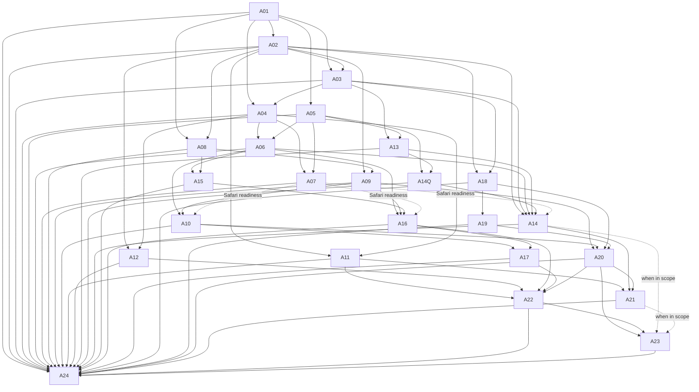

# Wisp Browser and Proactive Planning

> **Revision R1 (adopted by the user, 2026-09-27): small-model fit.** This revision keeps the
> A01 wire contract, safety obligations and delivery gates unchanged. It changes
> how the program uses the local model, with Ling 3.0 tiny as the reference:
>
> 1. A new qualification gate, **A14Q**, must pass before A14 is built.
> 2. A15 and A16 no longer depend on A14. Linked documents and Canvas use fixed,
>    reviewed code paths, and the model only extracts.
> 3. A new **Model runtime contract** section sets a per-step token budget,
>    constrained output, rules for sharing the one resident model, and a link
>    navigation rule.
> 4. Laya's role is stated explicitly: an advisory signal only, never a boundary
>    and never a browser driver.
> 5. The first delivery is the user-triggered "Read this page into Wisp" path,
>    which needs no agent loop.
>
> Proposed thresholds are marked *(proposed)* and need the Orchestrator's
> acknowledgement before they bind any worker. Dated progress snapshots are
> status overlays and are not changed by this revision.

## Progress snapshot (2026-09-27)

This is a status overlay, not a change to the approved A01-A24 scope below.
The Orchestrator's live ownership record and exact PR heads take precedence over
this dated snapshot. The verified `origin/main` head for this snapshot is
`0f7bce7254437f0ff1bcb816161910dd3b7f217d`.

**Merged bounded milestones:** A01 contracts ([#86](https://github.com/adjad/wisp/pull/86)),
A02 durable discovery storage/jobs ([#92](https://github.com/adjad/wisp/pull/92)),
and A03 durable exact approvals ([#93](https://github.com/adjad/wisp/pull/93)).
These are foundations, not a working browser-to-Today flow.

**Merged but incomplete foundations:** A04 authenticated bridge/transport/result
ACK ([#105](https://github.com/adjad/wisp/pull/105),
[#110](https://github.com/adjad/wisp/pull/110)) lacks production startup,
signed-app Keychain qualification, and an operational adapter. A05's shared
extraction core ([#103](https://github.com/adjad/wisp/pull/103)) lacks live DOM
acquisition and the private-context classifier. A06's Chrome capture/disclosure
boundary ([#109](https://github.com/adjad/wisp/pull/109)) is not an installable
extension/host and does not capture a live page. Earlier A08 temporal/grounded
extraction ([#91](https://github.com/adjad/wisp/pull/91),
[#94](https://github.com/adjad/wisp/pull/94)), A11 MIME parsing
([#88](https://github.com/adjad/wisp/pull/88)), and A12 caller-supplied message
normalization ([#89](https://github.com/adjad/wisp/pull/89)) are partial pieces,
not completion of those milestones.

| Milestone | Current state | Next condition |
| --- | --- | --- |
| A01-A03 | Bounded foundations merged; see above. | Preserve their contracts through later runtime integration. |
| A04-A06 | Partial, inactive foundations merged; see above. | Complete and qualify operational bridge, extraction, and Chrome host/capture. |
| A07 | [#112](https://github.com/adjad/wisp/pull/112) at `e81ec31a` is an inactive, buildable Safari extension target. Exact-head CI, Audit, and Live QA are nonblocking; task-specific Ship hold. | Protected integration, then host embedding, app wiring, and runtime/private-context qualification. |
| A08 | [#104](https://github.com/adjad/wisp/pull/104) at `c5fcc0a` is a draft full-extraction repair. Prior head `b573392` was Auditor BLOCK. | New head's full QA, replay, CI, independent Audit, and risk-triggered Live QA; no live model or Today integration yet. |
| A09 | [#108](https://github.com/adjad/wisp/pull/108) at `e2f076e` is a draft stacked on an older A08 head. | Reconcile after A08 integration and repeat all exact-head gates. |
| A10 | No complete program PR evidenced. Existing Today [#100](https://github.com/adjad/wisp/pull/100) is separate partial daily-use work. | Operational A06 plus integrated A09; demonstrate one real Chrome assignment page becoming a sourced Today item. |
| A11 | MIME parser only; no complete structured Mail ingestion PR evidenced. | Finish source/bridge integration and source-linked ingestion. |
| A12 | [#111](https://github.com/adjad/wisp/pull/111) at `8b5efaf` adds a read-only structured Messages feed. Exact-head CI, Audit, and Live QA are nonblocking; task-specific Ship hold. | Protected integration and remaining native-feed/digest use; do not count the earlier normalizer as full A12. |
| A13 | [#113](https://github.com/adjad/wisp/pull/113) at `97786fe` is a synthetic fixed-action foundation, not live browser execution. | Resolve full-QA manifest classification after the #107/#114 overlap, then CI, Audit, and Live QA. |
| A14-A17 | No complete program PR evidenced; dependency-gated. | A14 needs operational A06/A13; A15 needs A08/A14; A16 needs A07/A09/A14/A15; A17 needs A10/A16. |
| A18 | [#107](https://github.com/adjad/wisp/pull/107) at `518965d` implements bounded verified Reminders actions, with nonblocking exact-head gates and task-specific Ship hold. Stacked [#114](https://github.com/adjad/wisp/pull/114) at `80da955` repairs freshness/provenance/narration: offline QA 149/149 and Python CI passed; macOS CI and fresh Audit/Live QA remain pending. | Integrate in dependency order only after current gates and approval. #114 does **not** resolve Recently Deleted detection. |
| A19-A24 | No complete program PR evidenced; dependency-gated. | A19 needs A18; A20 needs A09/A10/A18/A19; A21 needs A11/A14/A20; A22 needs A11/A12/A16/A17/A20; A23 needs A14/A20/A21/A22; A24 qualifies the complete program. |

### Near-term sequence and open risks

1. Finish A08's current exact-head gates, integrate only after protected approval,
   then reconcile and requalify A09. In parallel, qualify the operational A04-A06
   path; merged boundaries alone cannot deliver A10.
2. Advance A07's reviewed staging PR through its Ship hold, then separately wire
   and qualify the Safari host/runtime. Keep A13's runner edit serialized with
   #107/#114 and other overlapping native paths.
3. Integrate A18's parent #107 before stacked #114. The latter's previous
   `c6c4e7c` candidate was Live QA BLOCK; its new head needs fresh evidence.
   There is no documented public EventKit active-vs-Recently-Deleted marker in
   the current read-only investigation. Supported non-EventKit interfaces and a
   truthful fail-closed UX remain open; do not label the full deletion complaint
   fixed or present ambiguous cached items as verified current reminders.
4. After operational Chrome capture and A09 reconciliation, deliver and verify
   A10's first real browser-to-Today item. Then unlock A14-A17 and A19-A24 in
   the dependency order above, rather than treating partial scaffolds as done.

Separate urgent Mail-summary [#102](https://github.com/adjad/wisp/pull/102)
remains outside A01-A24: its `1af7fd1` candidate was Auditor BLOCK and its sole
builder is repairing same-notice attribution. No A01-A24 browser runtime or
follow-on candidate in this snapshot has been installed or deployed by these PRs.

## Scope and architecture

A01 establishes contracts only. The approved program runs from A01 through A24,
plus the A14Q qualification gate added in R1. Only the Wisp Hub dispatches
program workers, with the Autonomous Orchestrator's ownership acknowledgement.
At most three eligible program workers may run at once. Dependencies and
exclusive path ownership determine eligibility. A01 does not implement
automation, persistence/migration, native integration, external effects,
installation, or deployment.

```
observations → local extraction/reconciliation → tracked obligations
             → Today work blocks/proposals → exact approval/execution
             → verified receipts → native/browser reconciliation
```

Two ways of acquiring observations feed this pipeline. They are deliberately
independent so the program does not depend on autonomous browsing:

- **Deterministic acquisition** (primary). User-triggered page capture (A05/A06/A07),
  fixed site adapters such as Canvas (A16), linked-document fetch (A15), and Mail and
  Messages feeds (A11/A12). The model only extracts from what code has already captured.
- **Model-driven investigation** (optional, A14). Ling chooses the next fixed browser
  command, one at a time, from a bounded view of the page. It is used only where no
  deterministic path exists, and only after A14Q qualifies the configured model.

These are separate concepts:

- **SourceObservation**: a captured source revision, capture time, text and stable
  source identity. Capture time is distinct from an obligation deadline.
- **Evidence**: a quote tied to an observation and its revision. A quote is not
  independently verified merely because it passes schema validation.
- **ActionableItem**: the obligation, with evidence, uncertainty, deadline,
  revision and completion receipt. It is not a Calendar event or Reminder.
- **ScheduledBlock**: time allocated to work on an obligation. Completing a block
  does not imply submitting an assignment or completing the obligation.
- **ExternalRecord**: a separately versioned record in a native or browser system.
  IDs and evidence link it to local state without conflating their lifecycles.
- **ActionProposal**: a proposed exact action tied to an obligation revision and
  evidence. Proposal state alone is never approval authority.
- **BrowserSnapshot / BrowserAction / BrowserTask**: a document-scoped DOM/text
  view, exact action intent and durable investigation state respectively.
- **ModelView** *(R1)*: a bounded, ranked projection of a BrowserSnapshot that a
  model actually sees. It is derived by code and carries its own coverage flag.
  It is not a new wire record in schema 1.0 (see Model runtime contract).
- **ActionReceipt**: the observed result. `uncertain` cannot complete an obligation
  and must be reconciled before an effect is retried. A verified scheduling or
  publishing receipt need not complete the underlying obligation.

## A01 wire contract, version 1.0

*Unchanged by R1.*

The canonical closed schema is `service/browser/contracts.py::SCHEMA`. Python
and JavaScript validators and Foundation-only Swift Codable records share the
same field registry. `scripts/check_browser_contracts.py` detects schema/type
mirror drift and runs the same synthetic corpus through all three runtimes.
`--sync-schema` explicitly regenerates the owned JS/Swift schema/type sections.
The checker never opens an application, contacts a site, or writes user state.

All object keys are required; nullable keys are encoded as JSON `null`. Unknown
keys, commands, enum values and schema versions are rejected. UTC timestamps
are nonnegative Unix milliseconds bounded by JavaScript's safe integer range;
numbers must be integral, and booleans are not integers. Text limits count Unicode
scalar values; unpaired surrogates are rejected. IDs are bounded ASCII opaque
strings. URLs are limited to HTTP(S) without user-info and with ASCII/percent-encoded
paths; source content and URLs remain untrusted. This is a deliberately restricted
wire URL grammar, not a general URL parser or permission allowlist.

Every top-level record carries `schema_version: "1.0"`. The initial release
supports exactly 1.0; a future version requires a deliberate protocol update.
Handshake peers advertise supported versions, capabilities and required
capabilities. Both peers' requirements must be in the capability intersection.
`incompatible_version` and `missing_capability` are explicit errors. A successful
handshake does not authenticate a peer or grant site/approval permission.

Capabilities: `dom_text`, `exact_app_approval`, `verified_receipts`,
`local_discovery`. Commands: `snapshot`, `navigate`, `click`, `fill`, `select`,
`scroll`, `back`, `wait`, `open_tab`, `handoff`. There is no arbitrary-JavaScript
command. Document/snapshot-scoped target IDs are required for click/fill/select;
URLs apply only to navigation/open-tab, and text only to fill/select.

Browser task states: `queued`, `running`, `waiting_approval`, `waiting_user`,
`paused_foreground`, `handed_off`, `succeeded`, `failed`, `cancelled`,
`outcome_unknown`. These expose browser-specific pause/handoff states while A02's
durable job abstraction retains its specified states below. State transitions,
claims and restart recovery belong to A02/A14; A01 validates state values and
rejects runnable tasks whose budget is exhausted.

Errors: `incompatible_version`, `missing_capability`, `invalid_payload`,
`disabled`, `site_permission_denied`, `private_context`, `foreground_preempted`,
`budget_exhausted`, `no_progress`, `unsupported_control`, `approval_required`,
`stale_approval`, `stale_snapshot`, `uncertain_receipt`, `bridge_unauthorized`,
`cancelled`. `retryable` is descriptive, not authorization to repeat an effect.

R1 needs no schema change. The ModelView and the model's constrained output are
internal to the service. The executor turns them into ordinary 1.0 `BrowserAction`
records before validation and execution.

## Safety and runtime obligations

*Unchanged by R1, except where marked.*

The contracts express the future defaults; they do not implement or prove the
live controls. Consumers must validate untrusted payloads before typed decoding
or use. Swift consumers use `WispBrowserContracts.decode`, not bare JSONDecoder.

- Explicit enablement and fresh site permissions are required. Private/incognito
  is excluded independently at capture and service boundaries; a sender's
  `private_context: false` cannot replace trusted runtime context checks.
  *(R1)* Private-context detection uses browser and OS APIs only. No model score,
  Laya included, may establish that a context is not private.
- Use a separate background tab, one proactive task, and foreground priority.
  An investigation gets 25 actions and five active minutes, excluding user wait;
  three consecutive no-progress results cause handoff. A02/A14 own durable,
  monotonic accounting and enforcement across restart/pause/resume. *(R1)* The
  five active minutes include model time. A14Q's measured step latency decides
  whether 25 actions fit in five minutes. If they don't, lower the action budget;
  don't raise the time budget.
- Ling stays local and replaceable. Use DOM/text first. Unsupported visual
  controls, authentication, CAPTCHA, permission failures and no-progress states
  hand off; no unrestricted JavaScript tool is exposed.
- Consequential effects and typing private data require exact app approval.
  A01 conservatively requires approval for every click, fill and select,
  including possible autosave effects. Approved intent must exactly match the
  action, task, snapshot, target, URL, text and effect flags. A03/A13 must resolve
  the proposal and current item revision, verify freshness/expiry, consume the
  trusted one-use approval atomically and invalidate it on edits or navigation.
  Payload equality alone never proves consent or exhausts the safety policy.
- Native bridge credentials and app approval authority are separate. Extension
  peers cannot advertise the app-approval credential role. The app/service must
  establish trusted identity, revocation and authorization outside these schemas;
  an extension-supplied object claiming `authority: app` is not sufficient.
- Ground quotes against captured source revisions. Do not infer completion or
  deletion from missing data in partial reads. Preserve conflicts, overrides,
  unknown dates and capture times; changed deadlines invalidate old proposals.
  *(R1)* A truncated ModelView counts as a partial read.
- Verified receipts require evidence. Completion additionally requires an approved,
  evidence-linked proposal and matching item/proposal/action/task/receipt
  relationships. Native writes, scheduling confirmations and Canvas submissions have
  different completion semantics.

## Model runtime contract *(R1)*

This section applies to every milestone that calls a local model: A08, A14, A14Q,
A15, A16, A21 and A22. It assumes a small model that shares one resident oMLX
instance with live chat, a 16k-token context window, and KV cache of about 128 KB
per token. A worker that configures a different model or window re-derives the
numbers here from measurement. It does not simply scale them.

### Roles

| Model | Browser-program role | Not allowed |
| --- | --- | --- |
| Ling 3.0 tiny (configured text role) | A08 extraction over captured text; A14 next-command choice from a ModelView. | Choosing endpoints, URLs outside the ModelView, approval decisions, completion decisions, or privacy classification. |
| Laya (`laya-multilingual-coreml`, 1,024 tokens) | Optional advisory signal only. Example: flag a proposed `fill` value as possibly private so it is shown more prominently in the approval UI. If Laya is unavailable, times out, is malformed or unsure, treat the result as "possibly private". | Deciding private/incognito context, granting or skipping approval, classifying whole pages (they are far larger than its window), or selecting browser actions. |
| Vision models | None in this program. Visual-only controls hand off. | Screenshot-driven action selection. Running a VLM for this inflates memory. |

Both roles are replaceable through role configuration. No milestone may hard-code
a model ID. A14 resolves its model through a dedicated `browser_agent` role,
which defaults to the `agent` role's model. It may point to a different model,
including one served by the Mac mini node, only after that exact model passes
A14Q. Any `browser_agent` model other than Ling adds the following to A14Q's
measurements: peak memory with both models resident, and chat decode speed while
the loop runs.

### Per-step context budget (A14)

Code enforces these ceilings before a request is sent. They are not prompt
guidance. Values are for the 16k reference window *(proposed)*:

| Segment | Ceiling (tokens) | Notes |
| --- | --- | --- |
| System instructions and safety summary | 1,000 | Fixed text in the explicit rules style. |
| Command menu | 500 | The closed command list as a JSON output schema, not native tool schemas. |
| Task goal and step history | 1,000 | Goal, plus a code-generated summary of prior steps: command, target label, outcome. It never includes raw earlier snapshots. |
| ModelView | 4,000 | At most 60 numbered interactive elements plus at most 2,500 tokens of ranked page text. |
| Output | 150 | One constrained action object. |
| **Total** | **≤ 6,650** | Leaves headroom for memory and live chat. Never fill the window. |

A05 produces the ModelView deterministically. It ranks and truncates elements and
text, records `coverage: complete | partial`, and keeps the mapping from each
element number to the snapshot-scoped target ID. The model never sees raw target
IDs or hidden, secret or draft fields that A05 filters out.

A08 extraction follows the same rule. Captured text is split into chunks so that
each request stays within about 8,000 tokens, including a 2,000-token output
ceiling. Per-chunk results are merged deterministically. Every quote must still
match its source revision exactly.

### Constrained output

- A14 output is schema-constrained JSON:
  `{"command": <enum>, "element": <int|null>, "url_ref": <int|null>, "text": <string|null>, "reason": <enum>}`.
  `element` and `url_ref` index into the ModelView. The executor maps them to 1.0
  target IDs and URLs, and rejects anything outside the view.
- Native tool calling is not used for the browser loop. On small models,
  tool-call reliability has depended on sampling and thinking settings (greedy
  sampling with thinking off gave 0/3 tool calls), and constrained JSON avoids that
  dependency.
- Use the production sampling profile qualified by `scripts/test_model.py`.
  Disable thinking where the model allows it. Otherwise strip it with leak detection:
  if thinking text is unclosed or leaks into the content, the output is invalid.
- If output is invalid, retry once with a repair prompt. A second failure counts as
  a no-progress result.

### Link navigation rule

The A01 contract gates `click` but not `navigate`. To make read-only research
workable:

- If a ModelView element is an anchor with an HTTP(S) `href` inside the task's
  granted site scope, the ModelView lists it as a `url_ref`. The model may request
  `navigate(url_ref)` without app approval.
- `href`s that match consequential patterns always go through `click` with approval.
  Patterns include logout, delete, unsubscribe, submit, confirm, accept, pay, and
  token- or nonce-bearing query parameters. A13 owns this list and an Auditor
  reviews it.
- GET links with side effects are a known residual risk. The Release Auditor
  reviews A13 with this rule in scope.

### Sharing the resident model

- At most one background model request runs at any time across A08, A14, A15,
  A16 and A22. Background requests never run concurrently with each other.
- A foreground turn preempts background work. If a background request is being
  generated, it is aborted, and the task goes to `paused_foreground` with its
  step not consumed. If no request is running, the next one does not start
  until the foreground is idle. Aborting mid-generation is required; yielding
  between steps alone is not enough.
- A22's scheduled scans use deterministic adapters first. They queue model
  extraction only for changed source revisions.

## A14Q — Ling browser qualification gate *(R1)*

A14 is not dispatched until A14Q passes for the configured model. A14Q is offline
and synthetic. It needs no live browser, site or credentials.

- **Corpus.** Recorded synthetic snapshots from fixture pages on `.invalid` hosts,
  run through the real A05 ModelView builder. It covers: finding an assignment in a
  course list, opening its details, pagination, a due date versus an availability
  date, a login wall, a CAPTCHA page, an unsupported visual control, a dead end, and
  a consequential-link trap. Each step is labeled with the acceptable next command(s)
  or the expected handoff.
- **Replay.** Single-step decisions and multi-step episodes. Episodes run against a
  deterministic simulator of the fixture site that uses the A13 executor's mapping.
- **Measurements.** Valid-output rate, top-1 next-command accuracy, episode success
  within budget, handoff correctness, tokens per step, p50 and p95 step latency, and
  peak memory. Latency and memory are measured both with the model idle and while a
  foreground chat turn contends.
- **Pass thresholds** *(proposed)*:
  - valid-output rate at least 98%
  - single-step accuracy at least 85%
  - episode success within budget at least 70%
  - handoff correctness on login, CAPTCHA and visual pages: 100%
  - p95 step latency under contention low enough that the budgeted action count
    fits in five active minutes
- **If A14Q fails**, A14 is descoped to a supervised mode: Ling suggests the next
  step and the user performs or approves it. Alternatively A14 is deferred. Neither
  outcome blocks A15, A16, A17 or A22.

## Approved program and dependencies

Rows marked *(R1)* differ from the original plan.

| ID | Outcome | Prerequisites | Bounded delivery / validation focus |
| --- | --- | --- | --- |
| A01 | Versioned browser/discovery contracts | — | Python/Swift/JS schemas, interfaces, negotiation/errors, synthetic shared fixtures and cross-language checks; this document. |
| A02 | Storage / durable jobs | A01 | Additive assistant DB tables/indexes; atomic claims, revisions, cancellation/restart recovery; queued/running/waiting_approval/waiting_user/succeeded/failed/cancelled/outcome_unknown; preserve overrides, capture times and old data. |
| A03 | Persistent proposals / policy | A01, A02 | Exact revision-bound one-use approvals, durable pending actions and existing safety policy; no permission bypass. |
| A04 | Authenticated native bridge | A01, A03 | Swift BrowserBridge/backend registration, observations/commands/results/disconnect; separate adapter/app-approval capabilities, protected credentials, revocation and message validation. |
| A05 *(R1)* | Shared JS page extraction + ModelView | A01 | Rendered text/headings/tables/links/labeled controls; document-scoped IDs/revisions/dedupe/coverage; filter secrets, hidden fields and drafts. **Adds** a deterministic, token-bounded ModelView builder (ranking, truncation, `coverage`, number-to-target mapping, `url_ref` for in-scope anchors). |
| A06 | Chrome observation adapter | A04, A05 | MV3 service worker/native helper; permissions/profile/session, incognito exclusion via browser APIs, Read this page into Wisp, reconnect without stale replay. |
| A07 | Safari adapter / extension target | A04, A05 | Shared JS/protocol, native handler, SwiftPM-adjacent appex embedding/resources/signing/compatibility, profile/private isolation. |
| A08 *(R1)* | Local obligation extraction | A01, A02 | Schema-constrained local model plus deterministic dates/fields; separate due/event/availability/estimates/unknowns; grounded evidence, recoverable invalid output. **Adds** chunking within the Model runtime contract budget, deterministic merge, and verbatim quote checks per chunk. |
| A09 | Reconciliation | A02, A08 | Source IDs/links first, corroborated similarity, conflicts/overrides and changed deadlines/locations/requirements; partial reads cannot delete or complete. |
| A10 *(R1)* | Discovery to Today | A06, A09 | Durable sourced items/evidence/uncertainty/change, Today projections/confirm/correct/dismiss/source links. **First milestone and first program delivery:** a user-triggered "Read this page into Wisp" on a real Chrome assignment page produces one sourced Today item, with no agent loop. Safari when A07 is ready. |
| A11 | Structured Mail + hyperlinks | A02, A04 | Account + RFC Message-ID, targeted MIME/HTML href + anchor without remote loading; timestamp/coverage/revision queue; recover Choose a time URL. |
| A12 | Structured Messages | A02, A04 | GUID/namespace IDs, conversation/sender/direction/time/text/links, digest compatibility, bounded context and queue dedupe. |
| A13 *(R1)* | Shared browser action executor | A03, A05 | Fixed click/scroll/fill/select/navigate/back/wait/open-tab; snapshot target checks, structured pre/post, autosave/consequential gates; no unrestricted JS. **Adds** ModelView-index-to-target mapping, rejection of out-of-view references, and the link navigation rule with its consequential-pattern list. |
| A14Q *(R1, new)* | Ling browser qualification | A05, A13 | Offline synthetic corpus and replay; measured validity/accuracy/handoff/latency/memory under contention against proposed thresholds; pass, supervised-mode or defer decision recorded by the Orchestrator. |
| A14 *(R1)* | Persistent Ling browser loop (optional investigation) | A02, A03, A06, A13, **A14Q** | Observe/choose/policy/execute/verify under the Model runtime contract; budgets/cancel/abort-on-foreground/tab ownership/takeover; auth/CAPTCHA/permission/no-progress handoff; status/pause/resume/cancel. Scope set by the A14Q outcome. Safari via A07. |
| A15 *(R1)* | Linked documents | A06, A08 | Bounded local PDFKit/DOCX/HTML/text, page/section refs, authenticated acquisition through a fixed extension-side fetch in the user's existing browser session without cookie export, temp cleanup/size/parser limits and unsupported handoff. **No longer depends on A14.** Links come from captured pages, Mail (A11) or site adapters (A16). |
| A16 *(R1)* | Registered sites / Canvas | A06, A09, A15 | Watched site/profile/account/entry/coverage/cursor registry. **Canvas uses a fixed adapter:** a reviewed, allowlisted set of read-only Canvas REST `GET` endpoints (courses, assignments, quizzes, announcements, syllabus) called from extension code within the user's session and site permission. No model-chosen endpoints, no token export. The model only extracts. Due vs availability, no policy bypass. Other registered sites use deterministic traversal where possible; they may use A14 only if A14Q passed. Safari when A07 is ready. |
| A17 | Multi-day Today | A10, A16 | Effort/remaining/preparation/dependencies/obligation-block links; deterministic rolling seven-day plan/backlog/carryover/pins/conflicts; editable labeled estimates, deadline vs busy event. |
| A18 | Verified Reminders | A02, A03 | Structured verified native results/IDs; durable claims for create/update/complete/delete; reconcile uncertain writes before retry. |
| A19 | Calendar destinations / updates | A18 | Writable calendar selection, exact event/occurrence updates, verified IDs/values/read-before-write/manual-edit conflicts and confirmation/invitation preview. |
| A20 | Publishing / reconciliation | A09, A10, A18, A19 | Exact proposals/calendar/list/account/alerts/batches, obligation-external mapping, manual-edit/partial-result reconciliation; task vs reminder vs Canvas submission; Today approvals. |
| A21 *(R1)* | Generic scheduling + RA | A11, A14, A20 | Slot/timezone/duration extraction, fresh calendar/preferences, privacy/booking approvals, recheck/submit once/verify confirmation, invitation duplicate avoidance. **The booking-page flow needs A14 at full scope.** If A14Q leads to supervised mode, A21 delivers extraction and proposal only, and the user completes the booking. |
| A22 *(R1)* | Proactive / urgency / brief | A11, A12, A16, A17, A20 | Durable coalesced source events, 30-minute watched scans / 10-minute unresolved next-24h scans run through deterministic adapters, with model extraction only on changed revisions, one background model request at a time, backoff/foreground abort, explainable urgency, Today/daily brief/notification dedupe/quiet hours/sleep catchup. |
| A23 *(R1)* | Controls / recovery / retention / diagnostics | A20, A22; A14 and A21 when in scope | Site pauses/source management/task status/approvals/handoff/freshness, cleanup/removal/privacy-safe metrics, needs-login/unavailable/unknown, fresh permissions/snapshot on resume. Includes per-step model latency/validity diagnostics for A08/A14. |
| A24 *(R1)* | Integration / release qualification | A01–A23, A14Q | Both-browser synthetic native fixtures; privacy/update/approval invalidation/interruption/duplicate/recovery; Chrome host + Safari packaging/sign/upgrade/removal; pinned gates/latency/resource qualification (including A14Q re-run on the release model), exact-SHA CI/audit/specialist QA. Deployment excluded. |


```mermaid
graph TD
    A01 --> A02
    A01 --> A03
    A02 --> A03
    A01 --> A04
    A03 --> A04
    A01 --> A05
    A04 --> A06
    A05 --> A06
    A04 --> A07
    A05 --> A07
    A01 --> A08
    A02 --> A08
    A02 --> A09
    A08 --> A09
    A06 --> A10
    A09 --> A10
    A02 --> A11
    A04 --> A11
    A02 --> A12
    A04 --> A12
    A03 --> A13
    A05 --> A13
    A05 --> A14Q
    A13 --> A14Q
    A02 --> A14
    A03 --> A14
    A06 --> A14
    A13 --> A14
    A14Q --> A14
    A06 --> A15
    A08 --> A15
    A06 --> A16
    A09 --> A16
    A15 --> A16
    A10 --> A17
    A16 --> A17
    A02 --> A18
    A03 --> A18
    A18 --> A19
    A09 --> A20
    A10 --> A20
    A18 --> A20
    A19 --> A20
    A11 --> A21
    A14 --> A21
    A20 --> A21
    A11 --> A22
    A12 --> A22
    A16 --> A22
    A17 --> A22
    A20 --> A22
    A20 --> A23
    A22 --> A23
    A14 -. when in scope .-> A23
    A21 -. when in scope .-> A23
    A01 & A02 & A03 & A04 & A05 & A06 & A07 & A08 & A09 & A10 & A11 & A12 --> A24
    A13 & A14Q & A14 & A15 & A16 & A17 & A18 & A19 & A20 & A21 & A22 & A23 --> A24
    A07 -. Safari readiness .-> A10
    A07 -. Safari readiness .-> A14
    A07 -. Safari readiness .-> A16
```

### Critical-path effect of R1

In the original plan, A14 blocked A15, A16, A17, A21, A22 and A23. After R1,
A14 blocks only A21's booking flow and its own controls in A23. The path to a
multi-day Today and proactive briefs becomes:

A05/A06 → A08 → A09 → A10 → A15 → A16 → A17 → A22

None of those steps needs autonomous browsing.

### Recommended delivery order *(R1)*

1. **User-triggered vertical slice.** A05 (with ModelView), operational A06, A08
   and A09 into A10: one real Chrome assignment page becomes one sourced Today item.
2. **A13 then A14Q**, in parallel with step 1 where ownership allows. A14Q is offline
   and touches no paths shared with A06, A08 or A09.
3. **A15, then A16 Canvas adapter**, then A17, then A22. This is proactive value
   without the agent loop.
4. **A14** at the scope A14Q allows, then A21, then A23.
5. **A18–A20** continue independently in dependency order.

## Validation and delivery

The shared synthetic corpus covers assignments, ambiguous exams, scheduling
URLs, changed deadlines and uncertain receipts, plus malformed fields, future
versions, missing capabilities, approval mismatches, private contexts, budgets,
and relationship errors. *(R1)* It also covers ModelView truncation and coverage,
out-of-view model references, consequential-link patterns, invalid and
thinking-leaked model output, and foreground abort mid-generation. All
addresses use reserved `.invalid` names; no live credentials or user data are
needed. Python regression tests also check schema mirror consistency and
independent boundary behavior. Swift checks compile just Foundation contracts and
a temporary harness, then perform typed decode/encode; this does not qualify the
native app or extension packaging.

Run `python3 scripts/check_browser_contracts.py` and the two owned Python test
modules with the repository test environment. Existing required repository CI
must also pass against the frozen remote SHA. An absent check is unavailable /
non-passing, never a CI pass. The Hub/Orchestrator owns exact-SHA Auditor and
applicable specialist-QA assignments, including normal audit and Live QA gates
specified by the A01 ownership ACK. A01's author does not approve their own work.
Commit/push and a reviewable PR are handoff artifacts, not merge or deployment.

*(R1)* A14Q results are recorded against the exact model ID, quantization,
sampling profile and candidate SHA. Changing any of them invalidates the result
for A14 and A24 purposes. The A13 link-navigation rule and A16's Canvas endpoint
allowlist trigger an independent Release Auditor review (outbound actions and
external integration).

Later tasks may extend this schema only with coordinated ownership and explicit
version/compatibility decisions. New persistence, extraction and runtime fields
must preserve the distinctions above; do not silently treat unknown or partially
observed facts as definite deadlines, completed obligations or confirmed effects.
