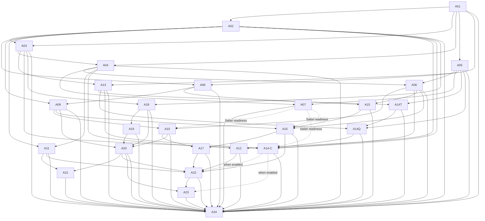

# Wisp Browser and Proactive Planning

> **Revision R2 (adopted by the user, 2026-09-27): small-model fit, Canvas-first browser loop.**
> This revision keeps the A01 wire contract, the safety obligations and the
> delivery gates unchanged.
>
> R1 (small-model fit):
>
> 1. A qualification gate, **A14Q**, must pass before the browser loop is built.
> 2. A15 and A16 no longer depend on the browser loop.
> 3. A **Model runtime contract** sets token budgets, constrained output, rules
>    for sharing the one resident model, and a link navigation rule.
> 4. The first delivery is the user-triggered "Read this page into Wisp" path.
>
> R2 (Canvas-first, System 1 / System 2, cloud teacher):
>
> 5. The only in-scope browser loop is the **Canvas assignment navigator
>    (A14-C)**. Generic-site investigation, A21 booking and generic A16 sites
>    are **deferred**.
> 6. A14-C uses a **tiered decision-maker** modeled on the jev harness pattern.
>    Code handles known pages, **Laya acts as System 1** (a fast typed decision
>    model that writes no text), and **Ling acts as System 2** only when Laya is
>    unsure.
> 7. A new **A14T cloud-teacher pipeline** uses a cloud model only on synthetic,
>    user-data-free material to build the test corpus, label it, and train or
>    calibrate Ling and Laya. No cloud model runs inside the Canvas loop.
>
> Proposed thresholds are marked *(proposed)* and need the Orchestrator's
> acknowledgement before they bind any worker. Dated progress snapshots are
> status overlays and are not changed by this revision.

## Progress snapshot (2026-09-27)

This is a status overlay, not a change to the approved A01-A24 scope below.
The Orchestrator's live ownership record and exact PR heads take precedence over
this dated snapshot. The verified `origin/main` head for this snapshot is
`0f7bce7254437f0ff1bcb816161910dd3b7f217d`.

**Merged bounded milestones:** A01 contracts ([#86](https://github.com/adjad/wisp/pull/86)),
A02 durable discovery storage/jobs ([#92](https://github.com/adjad/wisp/pull/92)),
and A03 durable exact approvals ([#93](https://github.com/adjad/wisp/pull/93)).
These are foundations, not a working browser-to-Today flow.

**Merged but incomplete foundations:** A04 authenticated bridge/transport/result
ACK ([#105](https://github.com/adjad/wisp/pull/105),
[#110](https://github.com/adjad/wisp/pull/110)) lacks production startup,
signed-app Keychain qualification, and an operational adapter. A05's shared
extraction core ([#103](https://github.com/adjad/wisp/pull/103)) lacks live DOM
acquisition and the private-context classifier. A06's Chrome capture/disclosure
boundary ([#109](https://github.com/adjad/wisp/pull/109)) is not an installable
extension/host and does not capture a live page. Earlier A08 temporal/grounded
extraction ([#91](https://github.com/adjad/wisp/pull/91),
[#94](https://github.com/adjad/wisp/pull/94)), A11 MIME parsing
([#88](https://github.com/adjad/wisp/pull/88)), and A12 caller-supplied message
normalization ([#89](https://github.com/adjad/wisp/pull/89)) are partial pieces,
not completion of those milestones.

| Milestone | Current state | Next condition |
| --- | --- | --- |
| A01-A03 | Bounded foundations merged; see above. | Preserve their contracts through later runtime integration. |
| A04-A06 | Partial, inactive foundations merged; see above. | Complete and qualify operational bridge, extraction, and Chrome host/capture. |
| A07 | [#112](https://github.com/adjad/wisp/pull/112) at `e81ec31a` is an inactive, buildable Safari extension target. Exact-head CI, Audit, and Live QA are nonblocking; task-specific Ship hold. | Protected integration, then host embedding, app wiring, and runtime/private-context qualification. |
| A08 | [#104](https://github.com/adjad/wisp/pull/104) at `c5fcc0a` is a draft full-extraction repair. Prior head `b573392` was Auditor BLOCK. | New head's full QA, replay, CI, independent Audit, and risk-triggered Live QA; no live model or Today integration yet. |
| A09 | [#108](https://github.com/adjad/wisp/pull/108) at `e2f076e` is a draft stacked on an older A08 head. | Reconcile after A08 integration and repeat all exact-head gates. |
| A10 | No complete program PR evidenced. Existing Today [#100](https://github.com/adjad/wisp/pull/100) is separate partial daily-use work. | Operational A06 plus integrated A09; demonstrate one real Chrome assignment page becoming a sourced Today item. |
| A11 | MIME parser only; no complete structured Mail ingestion PR evidenced. | Finish source/bridge integration and source-linked ingestion. |
| A12 | [#111](https://github.com/adjad/wisp/pull/111) at `8b5efaf` adds a read-only structured Messages feed. Exact-head CI, Audit, and Live QA are nonblocking; task-specific Ship hold. | Protected integration and remaining native-feed/digest use; do not count the earlier normalizer as full A12. |
| A13 | [#113](https://github.com/adjad/wisp/pull/113) at `97786fe` is a synthetic fixed-action foundation, not live browser execution. | Resolve full-QA manifest classification after the #107/#114 overlap, then CI, Audit, and Live QA. |
| A14-A17 | No complete program PR evidenced; dependency-gated. | A14 needs operational A06/A13; A15 needs A08/A14; A16 needs A07/A09/A14/A15; A17 needs A10/A16. |
| A18 | [#107](https://github.com/adjad/wisp/pull/107) at `518965d` implements bounded verified Reminders actions, with nonblocking exact-head gates and task-specific Ship hold. Stacked [#114](https://github.com/adjad/wisp/pull/114) at `80da955` repairs freshness/provenance/narration: offline QA 149/149 and Python CI passed; macOS CI and fresh Audit/Live QA remain pending. | Integrate in dependency order only after current gates and approval. #114 does **not** resolve Recently Deleted detection. |
| A19-A24 | No complete program PR evidenced; dependency-gated. | A19 needs A18; A20 needs A09/A10/A18/A19; A21 needs A11/A14/A20; A22 needs A11/A12/A16/A17/A20; A23 needs A14/A20/A21/A22; A24 qualifies the complete program. |

### Near-term sequence and open risks

1. Finish A08's current exact-head gates, integrate only after protected approval,
   then reconcile and requalify A09. In parallel, qualify the operational A04-A06
   path; merged boundaries alone cannot deliver A10.
2. Advance A07's reviewed staging PR through its Ship hold, then separately wire
   and qualify the Safari host/runtime. Keep A13's runner edit serialized with
   #107/#114 and other overlapping native paths.
3. Integrate A18's parent #107 before stacked #114. The latter's previous
   `c6c4e7c` candidate was Live QA BLOCK; its new head needs fresh evidence.
   There is no documented public EventKit active-vs-Recently-Deleted marker in
   the current read-only investigation. Supported non-EventKit interfaces and a
   truthful fail-closed UX remain open; do not label the full deletion complaint
   fixed or present ambiguous cached items as verified current reminders.
4. After operational Chrome capture and A09 reconciliation, deliver and verify
   A10's first real browser-to-Today item. Then unlock A14-A17 and A19-A24 in
   the dependency order above, rather than treating partial scaffolds as done.

Separate urgent Mail-summary [#102](https://github.com/adjad/wisp/pull/102)
remains outside A01-A24: its `1af7fd1` candidate was Auditor BLOCK and its sole
builder is repairing same-notice attribution. No A01-A24 browser runtime or
follow-on candidate in this snapshot has been installed or deployed by these PRs.

## Program decisions (user, 2026-09-27)

These product decisions bind program workers. They refine, and do not weaken,
the safety obligations below.

| ID | Decision |
| --- | --- |
| D1 | **Live page reading.** One click on "Read this page into Wisp" is consent to capture that tab's filtered visible text once. It goes through a new, separately audited live-capture boundary alongside A05's catalog path, not a relaxation of it. Secrets, hidden fields and drafts are filtered. Private windows are always denied, using browser/OS APIs. |
| D2 | **Site permissions.** A10 uses per-click `activeTab`-style access only, with no stored host permission. A16 later adds the user's Canvas domain as an opt-in allowlist in Wisp Settings. |
| D3 | **Installation.** Chrome: an unpacked developer-mode extension with a manifest `key` that pins its ID; Wisp installs the native-messaging host manifest only when the user opts in. Safari: the extension is embedded in Wisp.app as its containing app. No Chrome Web Store or App Store publishing. |
| D4 | **Enablement.** Off by default, per browser. Settings gets a Browser section with a per-browser enable toggle, a list of captured sources with revoke and "Forget this page", and a first-run disclosure shown before first enable. |
| D5 | **Today.** Unconfirmed captures appear in a labeled "From your pages" section of Today with their source quote. The user confirms, corrects or dismisses them. Dismiss means "not an obligation" and is remembered per source revision; it is never a hard delete. |
| D6 | **Retention.** Raw captured page text is kept for 30 days after capture, then purged. Evidence quotes linked to a live item are kept for that item's lifetime. "Forget this page" purges its observations and evidence immediately; a dismissal keeps only IDs and hashes. |
| D7 | **Profiles.** Per-profile opt-in. Each Chrome or Safari profile the user enables gets its own bridge identity and revocation. Incognito/private contexts never register. |
| D8 | **Safari parity.** Safari is in scope for A10, not deferred behind Chrome. The A07 extension ships inside Wisp.app and uses the same shared JS, ModelView and protocol. Private-window denial requires both the native handler's profile/context and the extension's own incognito state to agree, and unknown means deny. Until the build is signed with an Apple Developer ID, Safari requires Develop › Allow Unsigned Extensions, which resets on each Safari launch; this is a documented limitation, not a reason to weaken signing checks. |
| D9 | **A14T teacher.** Bulk synthetic generation and labeling use an Anthropic Claude model; its exact model ID is recorded per corpus version. The API key lives only in the build environment and is supplied by the user; workers never handle or store it. The user reviews the golden set personally. |

## Scope and architecture

A01 establishes contracts only. The approved program runs from A01 through A24,
plus A14Q and A14T added in R1/R2. Only the Wisp Hub dispatches program workers,
with the Autonomous Orchestrator's ownership acknowledgement. At most three
eligible program workers may run at once. Dependencies and exclusive path
ownership determine eligibility. A01 does not implement automation,
persistence/migration, native integration, external effects, installation, or
deployment.

```
observations → local extraction/reconciliation → tracked obligations
             → Today work blocks/proposals → exact approval/execution
             → verified receipts → native/browser reconciliation
```

Observations reach this pipeline in two ways. They are deliberately independent:

- **Deterministic acquisition** (primary):
  - user-triggered page capture (A05/A06/A07);
  - the Canvas REST adapter and linked-document fetch (A16/A15);
  - Mail and Messages feeds (A11/A12).

  The model only extracts from what code has already captured.
- **Canvas navigator, A14-C** (bounded, optional). A tiered loop that walks
  Canvas course pages to find assignments that the REST adapter doesn't surface
  well. Examples: work linked only from Modules or custom Pages, and syllabus
  tables. It is qualified by A14Q and is read-only by design.

### Deferred in R2

These keep their contract and safety text but are not dispatched until the user
resumes them:

- generic-site investigation in A14;
- A21's booking-page flow (A21 keeps extraction and proposals only);
- generic registered sites in A16 (A16 keeps Canvas only);
- A23 controls that exist only for the deferred items.

### Separate concepts

- **SourceObservation**: a captured source revision, capture time, text and stable
  source identity. Capture time is distinct from an obligation deadline.
- **Evidence**: a quote tied to an observation and its revision. A quote is not
  independently verified merely because it passes schema validation.
- **ActionableItem**: the obligation, with evidence, uncertainty, deadline,
  revision and completion receipt. It is not a Calendar event or Reminder.
- **ScheduledBlock**: time allocated to work on an obligation. Completing a block
  does not imply submitting an assignment or completing the obligation.
- **ExternalRecord**: a separately versioned record in a native or browser system.
  IDs and evidence link it to local state without conflating their lifecycles.
- **ActionProposal**: a proposed exact action tied to an obligation revision and
  evidence. Proposal state alone is never approval authority.
- **BrowserSnapshot / BrowserAction / BrowserTask**: a document-scoped DOM/text
  view, exact action intent and durable investigation state respectively.
- **ModelView**: a bounded, ranked, indexed projection of a BrowserSnapshot that
  a model actually sees. It is derived by code, carries its own coverage flag, and
  is service-internal (not a schema 1.0 wire record).
- **RouteMemory** *(R2)*: a per-course record of a working navigation path, such
  as "assignments live under Modules → Week N". It is service-internal, can be
  replayed by code, and is invalidated when replay fails.
- **ActionReceipt**: the observed result. `uncertain` cannot complete an obligation
  and must be reconciled before an effect is retried. A verified scheduling or
  publishing receipt need not complete the underlying obligation.

## A01 wire contract, version 1.0

*Unchanged.*

The canonical closed schema is `service/browser/contracts.py::SCHEMA`. Python
and JavaScript validators and Foundation-only Swift Codable records share the
same field registry. `scripts/check_browser_contracts.py` detects schema/type
mirror drift and runs the same synthetic corpus through all three runtimes.
`--sync-schema` explicitly regenerates the owned JS/Swift schema/type sections.
The checker never opens an application, contacts a site, or writes user state.

All object keys are required; nullable keys are encoded as JSON `null`. Unknown
keys, commands, enum values and schema versions are rejected. UTC timestamps
are nonnegative Unix milliseconds bounded by JavaScript's safe integer range;
numbers must be integral, and booleans are not integers. Text limits count Unicode
scalar values; unpaired surrogates are rejected. IDs are bounded ASCII opaque
strings. URLs are limited to HTTP(S) without user-info and with ASCII/percent-encoded
paths; source content and URLs remain untrusted. This is a deliberately restricted
wire URL grammar, not a general URL parser or permission allowlist.

Every top-level record carries `schema_version: "1.0"`. The initial release
supports exactly 1.0; a future version requires a deliberate protocol update.
Handshake peers advertise supported versions, capabilities and required
capabilities. Both peers' requirements must be in the capability intersection.
`incompatible_version` and `missing_capability` are explicit errors. A successful
handshake does not authenticate a peer or grant site/approval permission.

Capabilities: `dom_text`, `exact_app_approval`, `verified_receipts`,
`local_discovery`. Commands: `snapshot`, `navigate`, `click`, `fill`, `select`,
`scroll`, `back`, `wait`, `open_tab`, `handoff`. There is no arbitrary-JavaScript
command. Document/snapshot-scoped target IDs are required for click/fill/select;
URLs apply only to navigation/open-tab, and text only to fill/select.

Browser task states: `queued`, `running`, `waiting_approval`, `waiting_user`,
`paused_foreground`, `handed_off`, `succeeded`, `failed`, `cancelled`,
`outcome_unknown`. These expose browser-specific pause/handoff states while A02's
durable job abstraction retains its specified states below. State transitions,
claims and restart recovery belong to A02/A14; A01 validates state values and
rejects runnable tasks whose budget is exhausted.

Errors: `incompatible_version`, `missing_capability`, `invalid_payload`,
`disabled`, `site_permission_denied`, `private_context`, `foreground_preempted`,
`budget_exhausted`, `no_progress`, `unsupported_control`, `approval_required`,
`stale_approval`, `stale_snapshot`, `uncertain_receipt`, `bridge_unauthorized`,
`cancelled`. `retryable` is descriptive, not authorization to repeat an effect.

R1/R2 need no schema change. The ModelView, Laya/Ling decisions and RouteMemory
are internal to the service. The executor turns every decision into an ordinary
1.0 `BrowserAction` before validation and execution.

## Safety and runtime obligations

*Unchanged, except where marked.*

The contracts express the future defaults; they do not implement or prove the
live controls. Consumers must validate untrusted payloads before typed decoding
or use. Swift consumers use `WispBrowserContracts.decode`, not bare JSONDecoder.

- Explicit enablement and fresh site permissions are required. Private/incognito
  is excluded independently at capture and service boundaries; a sender's
  `private_context: false` cannot replace trusted runtime context checks.
  Private-context detection uses browser and OS APIs only. No model score,
  Laya included, may establish that a context is not private.
- Use a separate background tab, one proactive task, and foreground priority.
  An investigation gets 25 actions and five active minutes, excluding user wait;
  three consecutive no-progress results cause handoff. A02/A14 own durable,
  monotonic accounting and enforcement across restart/pause/resume. The five
  active minutes include model time. If A14Q shows 25 actions don't fit, lower
  the action budget; don't raise the time budget.
- Ling stays local and replaceable. Use DOM/text first. Unsupported visual
  controls, authentication, CAPTCHA, permission failures and no-progress states
  hand off; no unrestricted JavaScript tool is exposed.
- Consequential effects and typing private data require exact app approval.
  A01 conservatively requires approval for every click, fill and select,
  including possible autosave effects. Approved intent must exactly match the
  action, task, snapshot, target, URL, text and effect flags. A03/A13 must resolve
  the proposal and current item revision, verify freshness/expiry, consume the
  trusted one-use approval atomically and invalidate it on edits or navigation.
  Payload equality alone never proves consent or exhausts the safety policy.
  *(R2)* A14-C is read-only. Its action set excludes `fill` and `select`, and any
  `click` still requires approval, so a normal Canvas run asks for none.
- Native bridge credentials and app approval authority are separate. Extension
  peers cannot advertise the app-approval credential role. The app/service must
  establish trusted identity, revocation and authorization outside these schemas;
  an extension-supplied object claiming `authority: app` is not sufficient.
- Ground quotes against captured source revisions. Do not infer completion or
  deletion from missing data in partial reads. Preserve conflicts, overrides,
  unknown dates and capture times; changed deadlines invalidate old proposals.
  A truncated ModelView counts as a partial read.
- Verified receipts require evidence. Completion additionally requires an approved,
  evidence-linked proposal and matching item/proposal/action/task/receipt
  relationships. Native writes, scheduling confirmations and Canvas submissions have
  different completion semantics.
- *(R2)* **No runtime cloud inference touches browser-captured content.** Canvas
  pages contain enrollment, course content, grades and names. Every model call in
  A08, A14-C, A15, A16 and A22 is local, consistent with the Super Model policy,
  which keeps tool use and private-data reads local. Cloud models are used only
  in A14T, on synthetic data.

## Model runtime contract

This section applies to every milestone that calls a local model: A08, A14-C,
A14Q, A15, A16 and A22. It assumes a small model that shares one resident oMLX
instance with live chat, a 16k-token context window, and KV cache of about 128 KB
per token. A worker that configures a different model or window re-derives the
numbers here from measurement.

### Roles *(R2)*

| Model | Role | Not allowed |
| --- | --- | --- |
| **Laya**, System 1. `laya-multilingual-coreml`: a ModernBERT-large encoder plus decision heads, about 843 MB at FP16. It writes no text. | Typed decisions with calibrated probabilities: `choice` (one of N labels), `score` (graded), `noul` (true/false). Each answer also reports `confidence` and `act_probability`, an act-versus-escalate signal from a head trained with an escalation cost. Its A14-C jobs: page-type classification, per-link relevance, "contains a due date?" gating, and the escalate-to-Ling decision. It also keeps its existing Super Model routing role. | Deciding private/incognito context; granting or skipping approval; acting as any security boundary; generating text; seeing more than one bounded per-question state. |
| **Ling 3.0 tiny**, System 2 (`agent` role, via `browser_agent`) | A14-C escalations, choosing among Laya's top candidates; A08 extraction over captured text. | Choosing endpoints or URLs outside the ModelView, approval, completion or privacy decisions. |
| Vision models | None. Visual-only controls hand off. | Screenshot-driven action selection. |
| Cloud models | None at runtime. Build-time teacher in A14T only. | Any request containing captured page content or user data. |

Operational rules for Laya in A14-C:

- **Run it on the Neural Engine.** A14-C uses the Neural Engine build
  (`laya-multilingual-coreml-ane`) so it doesn't contend with Ling's GPU
  generation. Wisp's current Super Model integration runs Laya on CPU+GPU. A14-C
  must either use a separate Neural Engine instance or measure the contention.
- **Respect its input budget.** Each question's state plus the question and its
  options share one input: `max_len` 512 and `head_max_len` 192 tokens in the
  shipped config. A14-C asks many small questions, one per link or page, never
  one large one.
- **At most 10 options per choice.** The shipped calibration table has a
  distinct and anomalous temperature for 11+ options (`choice:11+` = 0.10 vs
  1.0–1.9 for smaller buckets). Larger sets are ranked with per-item `score` or
  `noul` questions.
- **Batch questions.** Questions run in batches of the model's configured batch
  size. Per the jev harness pattern, adding questions to a request should barely
  change latency. A14Q measures whether that holds for the ANE build.
- **If Laya is unavailable, times out, or returns malformed or non-finite
  output,** the step escalates to Ling. For privacy-adjacent uses (a fill value
  flagged as possibly private), those outcomes count as "possibly private".

`browser_agent` resolves to the `agent` model by default. It may point to a
different model, including one served by the Mac mini node, only after that exact
model passes A14Q. A non-Ling model adds two measurements to A14Q: peak memory
with both models resident, and chat decode speed while the loop runs.

### Per-step context budget

Code enforces these ceilings. For Tier 2 (Ling) in A14-C *(proposed)*:

| Segment | Ceiling (tokens) |
| --- | --- |
| System instructions, Canvas-specific, with few-shot examples | 1,200 |
| Output schema | 200 |
| Goal and code-written step history | 600 |
| Laya's top 5 candidates with labels, breadcrumbs and surrounding text | 1,500 |
| Page summary (headings plus ranked text) | 1,000 |
| Output | 60 |
| **Total** | **≤ 4,560** |

If a deferred use case is resumed, the R1 generic budget (60 elements plus
2,500 text tokens, total ≤ 6,650) applies to it.

A08 extraction splits captured text into chunks so each request stays within
about 8,000 tokens, including a 2,000-token output ceiling. Per-chunk results are
merged deterministically. Every quote must match its source revision exactly.

### Constrained output

- Ling's Tier 2 output is schema-constrained JSON:
  `{"choice": 1|2|3|4|5|"back"|"handoff", "reason": <enum>}`.
  Code maps the choice to a 1.0 action and rejects anything else.
- Native tool calling is not used for the loop. Use the production sampling
  profile qualified by `scripts/test_model.py`. Disable thinking where the model
  allows it; otherwise unclosed or leaked thinking makes the output invalid.
- If output is invalid, retry once with a repair prompt. A second failure counts
  as a no-progress step.

### Link navigation rule

- An anchor with an HTTP(S) `href` inside the granted site scope becomes a
  `navigate` candidate that needs no approval.
- `href`s matching consequential patterns always require approval. Patterns
  include logout, delete, unsubscribe, submit, confirm, accept, pay, and token-
  or nonce-bearing parameters. For Canvas, submission, quiz-start, and
  "mark as done" endpoints are also always excluded from A14-C candidates. A13
  owns the list, and a Release Auditor reviews it.
- GET links with side effects remain a residual risk, reviewed by the Auditor.

### Sharing the resident model

- At most one background model request runs at a time across A08, A14-C, A15,
  A16 and A22.
- A foreground turn aborts any in-progress background generation. The task moves
  to `paused_foreground` and the step isn't consumed. If no request is running,
  the next one waits until the foreground is idle.
- Laya calls on the Neural Engine don't count as resident-model requests, but
  they also pause while a foreground turn is running.
- A22's scheduled scans use the Canvas REST adapter and RouteMemory replay first.
  They queue model work only for changed source revisions.

## A14-C — Canvas assignment navigator *(R2)*

**Goal.** Given a course the user has registered, find every assignment page and
its due or availability information, including assignments reachable only
through Modules, custom Pages or the syllabus. Hand each assignment page to
A08/A09. The navigator is read-only.

**Design lineage.** The action design follows browser-use's `jev-ultrafast`
(MIT license), with local models substituted for its hosted ones:

- The page becomes an **indexed action table**.
- A System 1 decision picks the **operation and target together** from the
  compatible options.
- A text model is invoked **only when text must be generated**. A14-C never
  generates text, because it never fills fields.
- `DONE` and `BLOCKED` are explicit operations. `DONE` still requires
  independent outcome verification.
- Model output never becomes selectors, coordinates, shell commands or
  JavaScript.
- The executor rechecks page freshness and click occlusion.

jev-ultrafast attributes much of its speedup to cutting browser round trips
(1,092 to 101 protocol calls; median task time 9.45s to 7.09s). A05/A06 therefore
capture one batched snapshot per step, not per-element queries.

The upstream jev model is a hosted API. Under this plan's privacy rule it cannot
see Canvas content, so Laya takes its place locally.

### Per-step flow

1. **Preflight (code).** Enabled, permission fresh, not a private context,
   foreground idle, own background tab.
2. **Snapshot (A05).** One batched capture, filtered for secrets, hidden fields and
   drafts. Consequential and excluded Canvas links are removed from the candidates.
3. **Tier 0: code.**
   - If RouteMemory has a route for this course, replay the next hop.
   - Otherwise, if the URL matches a known Canvas pattern (`/courses/:id`,
     `/assignments`, `/assignments/:id`, `/modules`, `/pages/:slug`, `/syllabus`),
     apply the state machine's fixed next move.
   - If replay fails, invalidate that route and fall through.
4. **Tier 1: Laya (milliseconds, Neural Engine).**
   - **Page type:** a `choice` among assignment list, assignment detail, module
     list, content page, syllabus, login wall, error, or other. The state is the
     URL path, title, headings and leading text, fitted to the per-question
     budget.
   - **Link relevance:** one `score` or `noul` question per candidate link
     ("Leads to an assignment or its due date?"). The state is the goal, link text,
     breadcrumb, and nearby heading.
   - **Date gate:** `noul` "States a due or availability date?", to decide whether
     A08 runs on this page.
   - **Act or escalate.** Laya acts alone (navigate to the top link, mark done, or
     hand off) only when all three hold *(proposed)*:
     - `act_probability` ≥ 0.8;
     - the top relevance beats the second by at least 0.25;
     - page-type confidence is ≥ 0.8.

     Otherwise the step escalates. Login walls and errors always hand off,
     whatever the confidence.
5. **Tier 2: Ling (seconds, GPU).** Ling chooses among Laya's top five candidates,
   `back` or `handoff`, within the budget above.
6. **Policy and execute (A13).** Map the choice to a 1.0 `navigate`, `scroll`,
   `back`, `wait` or `handoff`, then execute and take a new snapshot.
7. **Verify and record (code).**
   - Progress is a new page type or new relevant links.
   - Successful hops are appended to RouteMemory.
   - Pages that pass the date gate go to A08/A09 extraction.
   - `DONE` requires that every discovered assignment has been extracted or
     explicitly marked `unknown`. The model saying "done" is not enough.
8. **Stop.** Budget exhausted, 3 no-progress steps, login/CAPTCHA/visual/error,
   or `DONE` verified. Foreground activity aborts and pauses the task.

### Expected shape of a run

On a standard course, Tier 0 handles almost every step. On first discovery in an
irregular course, Tier 1 handles most of the rest, and Ling is called only for
genuinely ambiguous links. Later runs replay RouteMemory. Tier usage is recorded
per step (A23 diagnostics), so escalation rates are measured, not assumed.

### Limits that remain

- Shadow roots, frames, canvas-drawn content, pop-up tabs, nested scroll
  containers and custom keyboard widgets are out of scope, as in jev-ultrafast's
  MVP. They hand off.
- Laya's accuracy and calibration on Canvas decisions are unknown until A14Q/A14T.
  It was not trained for this task.
- Canvas LTI/external-tool frames (publisher platforms, Gradescope) are
  cross-origin. A14-C hands them off; it does not follow them.
- Prompt injection in course content can still skew navigation or extraction
  within the course. It cannot cause an effect: A14-C has no fill, select or
  unapproved click.

## A14T — Cloud-teacher training and calibration *(R2)*

The cloud model is a **build-time teacher**, never a runtime participant. A14T
produces versioned local model artifacts and calibration files. It does not ship
code paths that call a cloud model.

### Data rule

- **Allowed.** Teacher inputs are synthetic only:
  - generated Canvas-like course sites on `.invalid` hosts;
  - authored instructor layouts;
  - generated assignment text and dates;
  - adversarial pages.
- **Not allowed.** Real Canvas pages, captured snapshots, RouteMemory, user
  courses, names, grades or any Wisp store never leave the machine. That holds
  even if redacted, and even if Laya scores them as low risk.
- **Enforcement.** Every corpus file carries a generator provenance record. The
  training scripts refuse inputs without one.

### Pipeline

1. **Generate (cloud).** Varied synthetic course sites render as static fixtures:
   - standard, modules-only, pages-only, syllabus-table, and mixed layouts;
   - hidden Assignments tab;
   - due vs availability vs "late until" wording;
   - relative and ambiguous dates;
   - multilingual courses;
   - login walls and error pages;
   - consequential-link traps;
   - injection-laden content.
2. **Label (cloud, then human review).** The teacher labels:
   - page type;
   - link relevance;
   - the correct next action or handoff;
   - due-date spans.

   A **golden set** is reviewed by a person and never used for training. It's
   the only set used to accept a model, so the teacher never grades itself.
3. **Trajectories (local).** Fixture sites are replayed through the real A05
   ModelView builder and A13 mapping, producing Tier 1 question/answer pairs and
   Tier 2 prompt/choice pairs in exactly the runtime format.
4. **Laya, stage A: calibration only** (no weight changes). Fit A14-C's
   thresholds (`act_probability`, relevance margin, page-type confidence) and,
   if needed, a temperature per question type on the training split.
   Acceptance is measured on the golden set.
5. **Laya, stage B: fine-tune, conditional.** Only if stage A misses A14Q
   targets.
   - The Laya distributions in this repo include inference and conversion code
     but no training implementation. Stage B requires the upstream
     `convaiinnovations/laya` training code (Apache-2.0) or a Wisp-owned head
     trainer over the ModernBERT encoder.
   - Output is converted to the Neural Engine CoreML build with
     `laya-coreml[convert]`.
   - The artifact gets a hash manifest, like the existing `laya-mlx` manifest.
6. **Ling: prompt first, LoRA second.**
   - First, pick few-shot examples for the Tier 2 prompt from teacher-labeled
     trajectories.
   - A LoRA adapter (mlx-lm) on Tier 2 prompt/choice pairs and A08 extraction
     pairs is trained only if prompting misses targets.
   - The adapter is versioned separately from the base weights and applies only
     under the `browser_agent` and extraction roles, never the chat roles.
7. **Red-team (cloud-generated, local evaluation).** Injection and trap pages
   are scored on escalation and handoff behavior, not only accuracy.
8. **Promote.**
   - A14Q is rerun on the golden set with the candidate artifact(s) at
     production sampling.
   - Results are recorded against exact artifact hashes, base model, sampling
     profile and code SHA.
   - Any change invalidates prior results.
   - The previous artifact is kept for rollback.

### Governance

- The teacher's provider and model ID are recorded per corpus version.
- Cloud credentials stay in the build environment and never ship.
- A14T changes model artifacts and packaged runtime dependencies. That triggers
  the Release Auditor (packaging, model provenance) and specialist QA (privacy:
  confirm no user-data path reaches the teacher).

## A14Q — Canvas navigator qualification gate *(R2)*

A14-C is not enabled for users until A14Q passes. A14Q is offline and synthetic
and uses A14T's golden set.

- **Measurements.**
  - Per tier: decision accuracy, escalation rate, and handoff correctness.
  - End to end: episode success within budget, and steps and time per episode.
  - Performance: Laya latency per batch (ANE), Ling p50/p95 step latency, and
    peak memory, both with the model idle and under foreground contention.
  - Validity: valid-output rate for Ling.
- **Pass thresholds** *(proposed)*:
  - Tier 1 accuracy on the decisions it takes without escalating: ≥ 97%.
  - Tier 2 top-1 accuracy: ≥ 85%.
  - Ling valid-output rate: ≥ 98%.
  - Episode success on the golden set: ≥ 90%.
  - Handoff on login/CAPTCHA/error/trap pages: 100%.
  - Zero out-of-scope or consequential navigations.
  - Budgeted actions fit in five active minutes at p95 under contention.
- **Report, don't gate:** the share of steps handled by each tier.
- **If A14Q fails:** A14-C is descoped to a supervised mode, where it suggests the
  next link and the user navigates. Alternatively it stays disabled while A14T
  iterates. Neither outcome blocks A15, A16 (REST adapter), A17 or A22.

## Approved program and dependencies

Rows marked *(R1)* or *(R2)* differ from the original plan.

| ID | Outcome | Prerequisites | Bounded delivery / validation focus |
| --- | --- | --- | --- |
| A01 | Versioned browser/discovery contracts | — | Python/Swift/JS schemas, interfaces, negotiation/errors, synthetic shared fixtures and cross-language checks; this document. |
| A02 | Storage / durable jobs | A01 | Additive assistant DB tables/indexes; atomic claims, revisions, cancellation/restart recovery; queued/running/waiting_approval/waiting_user/succeeded/failed/cancelled/outcome_unknown; preserve overrides, capture times and old data. |
| A03 | Persistent proposals / policy | A01, A02 | Exact revision-bound one-use approvals, durable pending actions and existing safety policy; no permission bypass. |
| A04 | Authenticated native bridge | A01, A03 | Swift BrowserBridge/backend registration, observations/commands/results/disconnect; separate adapter/app-approval capabilities, protected credentials, revocation and message validation. |
| A05 *(R1/R2)* | Shared JS page extraction + ModelView | A01 | Rendered text/headings/tables/links/labeled controls; document-scoped IDs/revisions/dedupe/coverage; filter secrets, hidden fields and drafts. Adds a deterministic indexed ModelView, one batched snapshot per step, and Canvas consequential-link exclusion. |
| A06 | Chrome observation adapter | A04, A05 | MV3 service worker/native helper; permissions/profile/session, incognito exclusion via browser APIs, Read this page into Wisp, reconnect without stale replay. |
| A07 | Safari adapter / extension target | A04, A05 | Shared JS/protocol, native handler, SwiftPM-adjacent appex embedding/resources/signing/compatibility, profile/private isolation. |
| A08 *(R1)* | Local obligation extraction | A01, A02 | Schema-constrained local model plus deterministic dates/fields; separate due/event/availability/estimates/unknowns; grounded evidence, recoverable invalid output; chunking within budget, deterministic merge, verbatim quote checks. |
| A09 | Reconciliation | A02, A08 | Source IDs/links first, corroborated similarity, conflicts/overrides and changed deadlines/locations/requirements; partial reads cannot delete or complete. |
| A10 *(R1, D8)* | Discovery to Today | A06, A07, A09 | First program delivery, in Chrome and Safari (D8): a user-triggered "Read this page into Wisp" on a real Chrome assignment page produces one sourced Today item, with no agent loop. Then durable items/evidence/uncertainty/change, Today confirm/correct/dismiss/source links. Safari when A07 is ready. |
| A11 | Structured Mail + hyperlinks | A02, A04 | Account + RFC Message-ID, targeted MIME/HTML href + anchor without remote loading; timestamp/coverage/revision queue; recover Choose a time URL. |
| A12 | Structured Messages | A02, A04 | GUID/namespace IDs, conversation/sender/direction/time/text/links, digest compatibility, bounded context and queue dedupe. |
| A13 *(R1)* | Shared browser action executor | A03, A05 | Fixed click/scroll/fill/select/navigate/back/wait/open-tab; snapshot target checks, freshness/occlusion recheck, structured pre/post, autosave/consequential gates; ModelView index mapping; link navigation rule and consequential-pattern list; no unrestricted JS. |
| A14T *(R2, new)* | Cloud-teacher corpus, labels, calibration and training | A05, A13 | Synthetic-only data rule with provenance enforcement; golden set reviewed by a person; Laya calibration (stage A), conditional fine-tune and ANE conversion (stage B); Ling few-shot then conditional LoRA; versioned hashed artifacts; Auditor and privacy QA. |
| A14Q *(R2)* | Canvas navigator qualification | A05, A13, A14T | Offline per-tier and end-to-end replay on the golden set; proposed thresholds; outcome is pass, supervised mode or disabled, recorded by the Orchestrator. |
| A14-C *(R2)* | Canvas assignment navigator | A02, A03, A06, A13, A14Q | Tier 0 code/RouteMemory, Tier 1 Laya (ANE), Tier 2 Ling; read-only action set; budgets/abort-on-foreground/tab ownership/takeover; handoff on auth/CAPTCHA/frames/errors/no-progress; verified `DONE`; per-tier diagnostics. Generic-site A14 **deferred**. Safari via A07. |
| A15 *(R1)* | Linked documents | A06, A08 | Bounded local PDFKit/DOCX/HTML/text, page/section refs, fixed extension-side fetch in the user's session without cookie export, temp cleanup/size/parser limits, unsupported handoff. |
| A16 *(R1/R2)* | Canvas REST adapter and registry | A06, A09, A15 | Registered Canvas site/profile/account/course/coverage/cursor registry; reviewed allowlist of read-only Canvas REST `GET` endpoints called from extension code within the user's session; model extracts only; due vs availability; provides course lists and seeds to A14-C. Generic registered sites **deferred**. |
| A17 | Multi-day Today | A10, A16 | Effort/remaining/preparation/dependencies/obligation-block links; deterministic rolling seven-day plan/backlog/carryover/pins/conflicts; editable labeled estimates, deadline vs busy event. |
| A18 | Verified Reminders | A02, A03 | Structured verified native results/IDs; durable claims for create/update/complete/delete; reconcile uncertain writes before retry. |
| A19 | Calendar destinations / updates | A18 | Writable calendar selection, exact event/occurrence updates, verified IDs/values/read-before-write/manual-edit conflicts and confirmation/invitation preview. |
| A20 | Publishing / reconciliation | A09, A10, A18, A19 | Exact proposals/calendar/list/account/alerts/batches, obligation-external mapping, manual-edit/partial-result reconciliation; task vs reminder vs Canvas submission; Today approvals. |
| A21 *(R2)* | Generic scheduling extraction + proposals | A11, A20 | Slot/timezone/duration extraction, fresh calendar/preferences, privacy approvals, invitation duplicate avoidance. The booking-page browser flow is **deferred**; the user completes bookings. |
| A22 *(R2)* | Proactive / urgency / brief | A11, A12, A16, A17, A20; A14-C when enabled | Durable coalesced source events; 30-minute watched / 10-minute unresolved next-24h scans via REST adapter and RouteMemory replay first; A14-C only for courses the adapter can't cover; one background model request at a time; foreground abort; explainable urgency; Today/daily brief/notification dedupe/quiet hours/sleep catchup. |
| A23 *(R2)* | Controls / recovery / retention / diagnostics | A20, A22; A14-C when enabled | Site/course pauses, source management, task status, approvals, handoff, freshness; cleanup/removal/privacy-safe metrics (including per-tier A14-C usage and latency); needs-login/unavailable/unknown; fresh permissions/snapshot on resume; RouteMemory inspection and reset. |
| A24 *(R2)* | Integration / release qualification | A01–A23, A14T, A14Q, A14-C | Both-browser synthetic native fixtures; privacy/update/approval invalidation/interruption/duplicate/recovery; Chrome host + Safari packaging/sign/upgrade/removal; model-artifact provenance; A14Q rerun on release artifacts; pinned gates/latency/resource qualification; exact-SHA CI/audit/specialist QA. Deployment excluded. |


```mermaid
graph TD
    A01 --> A02
    A01 --> A03
    A02 --> A03
    A01 --> A04
    A03 --> A04
    A01 --> A05
    A04 --> A06
    A05 --> A06
    A04 --> A07
    A05 --> A07
    A01 --> A08
    A02 --> A08
    A02 --> A09
    A08 --> A09
    A06 --> A10
    A09 --> A10
    A02 --> A11
    A04 --> A11
    A02 --> A12
    A04 --> A12
    A03 --> A13
    A05 --> A13
    A05 --> A14T
    A13 --> A14T
    A05 --> A14Q
    A13 --> A14Q
    A14T --> A14Q
    A02 --> A14C[A14-C]
    A03 --> A14C
    A06 --> A14C
    A13 --> A14C
    A14Q --> A14C
    A06 --> A15
    A08 --> A15
    A06 --> A16
    A09 --> A16
    A15 --> A16
    A10 --> A17
    A16 --> A17
    A02 --> A18
    A03 --> A18
    A18 --> A19
    A09 --> A20
    A10 --> A20
    A18 --> A20
    A19 --> A20
    A11 --> A21
    A20 --> A21
    A11 --> A22
    A12 --> A22
    A16 --> A22
    A17 --> A22
    A20 --> A22
    A14C -. when enabled .-> A22
    A20 --> A23
    A22 --> A23
    A14C -. when enabled .-> A23
    A01 & A02 & A03 & A04 & A05 & A06 & A07 & A08 & A09 & A10 & A11 & A12 --> A24
    A13 & A14T & A14Q & A14C & A15 & A16 & A17 & A18 & A19 & A20 & A21 & A22 & A23 --> A24
    A07 -. Safari readiness .-> A10
    A07 -. Safari readiness .-> A14C
    A07 -. Safari readiness .-> A16
```

### Critical path

The path to a multi-day Today and proactive briefs needs no browser loop:

A05/A06 → A08 → A09 → A10 → A15 → A16 → A17 → A22

A14-C adds coverage for irregular courses. It runs in parallel with that path:

A13 → A14T → A14Q → A14-C

### Recommended delivery order *(R2)*

1. **User-triggered vertical slice.** A05 (with ModelView), operational A06, A08
   and A09 into A10: one real Chrome assignment page becomes one sourced Today item.
2. **In parallel where ownership allows:** A13, then A14T (synthetic corpus and
   golden set first; Laya stage A calibration next), then A14Q. None of these
   touch A06/A08/A09 paths.
3. **A15, then the A16 Canvas REST adapter**, then A17. Canvas assignments reach
   Today without the loop.
4. **A14-C** at the scope A14Q allows, enabled per course as a supplement to A16.
5. **A22 and A23**, using the adapter and RouteMemory first.
6. **A18–A20** continue independently. A21 keeps extraction and proposals only.

## Validation and delivery

The shared synthetic corpus covers assignments, ambiguous exams, scheduling
URLs, changed deadlines and uncertain receipts, plus malformed fields, future
versions, missing capabilities, approval mismatches, private contexts, budgets,
and relationship errors. It also covers ModelView truncation and coverage,
out-of-view model references, consequential-link patterns, invalid and
thinking-leaked model output, and foreground abort mid-generation.

*(R2)* A14T's Canvas fixtures and golden set extend the corpus. They cover:

- Tier 0 route replay and invalidation;
- Laya timeout or malformed output escalating to Ling;
- threshold edges;
- frames and external tools handing off;
- a verified `DONE` versus a model-claimed `DONE`.

All addresses use reserved `.invalid` names; no live credentials or user data are
needed. Python regression tests also check schema mirror consistency and
independent boundary behavior. Swift checks compile just Foundation contracts and
a temporary harness, then perform typed decode/encode; this does not qualify the
native app or extension packaging.

Run `python3 scripts/check_browser_contracts.py` and the two owned Python test
modules with the repository test environment. Existing required repository CI
must also pass against the frozen remote SHA. An absent check is unavailable /
non-passing, never a CI pass. The Hub/Orchestrator owns exact-SHA Auditor and
applicable specialist-QA assignments, including normal audit and Live QA gates
specified by the A01 ownership ACK. A01's author does not approve their own work.
Commit/push and a reviewable PR are handoff artifacts, not merge or deployment.

A14Q results are recorded against the exact model artifacts (base model,
quantization, LoRA and Laya hashes), sampling profile, thresholds and code SHA.
Changing any of them invalidates the result. Four things trigger an independent
Release Auditor review:

- the A13 link-navigation rule;
- the Canvas consequential-link exclusions;
- A16's REST endpoint allowlist;
- A14T's model artifacts.

A14T also triggers privacy specialist QA.

Later tasks may extend this schema only with coordinated ownership and explicit
version/compatibility decisions. New persistence, extraction and runtime fields
must preserve the distinctions above; do not silently treat unknown or partially
observed facts as definite deadlines, completed obligations or confirmed effects.

## References *(R2)*

- browser-use, `jev-ultrafast` (MIT license): indexed action space, operation
  and target decided together, text model only for typed input, verified `DONE`,
  browser-round-trip reduction. <https://github.com/browser-use/jev-ultrafast>
- LangChain, "Building a harness with Jev": System 1 typed decisions
  (choice/score/noul) with calibrated probabilities, parallel questions per
  request, escalation of open-ended work to a larger model.
  <https://www.langchain.com/blog/building-a-harness-with-jev>
- `laya-coreml` 0.1.0 (Apache-2.0) and the `aac6fef/laya-mlx` model card:
  ModernBERT-large encoder, `max_len` 512 / `head_max_len` 192,
  calibration temperatures per option count, act/escalate head, no training code.
